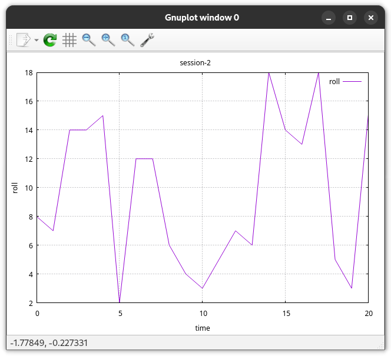
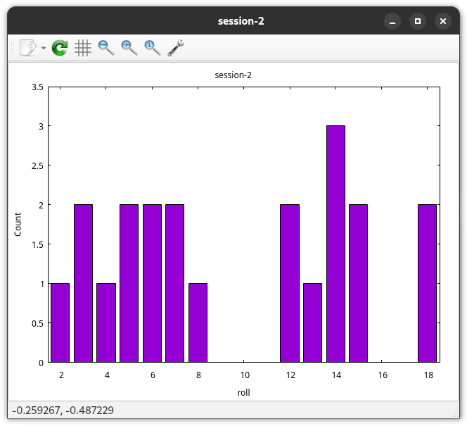

# csvizmo


Gizmos for working with CSVs

# Philosophy

Rather than to build an infinitely flexible, highly optimized, does-everything-and-more toolkit (see
<https://github.com/dathere/qsv> for that) these gizmos are targeted tools to solve specific
problems I frequently encounter.

All tools operate on stdin/stdout in addition to files, and are designed to be chained together with
pipes. Any ancillary output is emitted on stderr.

# How to use

You can install the gizmos with

```sh
./install --prefix ~/.local/
./install --uninstall --prefix ~/.local/
```

You can also do just

```sh
cargo install --path . --root ~/.local/
```

but that won't install any of the non-Rust scripts from this project.

You can also just experiment the gizmos by

```sh
cargo run --release --bin can2csv -- ...
```

You likely want a release build. As an example, the `can2k` tool runs in 2.4s with a release build
on a 1 hour candump, but 23s with a debug build.

# Gizmos

See <https://github.com/Notgnoshi/csvizmo/labels/gizmo> for the gizmos I have planned.

## csvplot

Plot data from a CSV file. Supports line (X & Y) and time series (Y only) plots. Multiple columns
can be plotted at once, so long as they share the same X axis.

```sh
$ head session-2.csv
roll
8
7
14
$ csvplot -y rolls session-2.csv
```



## csvstats

Calculate summary statistics for CSV columns.

```sh
$ csvstats --column roll session-2.csv
Stats for column "roll":
    count: 21
    Q1: 5
    median: 8
    Q3: 14
    min: 2 at index: 0
    max: 18 at index: 19
    mean: 9.571428571428571
    stddev: 5.401964631566671
```

`csvstats` can also generate histogram plots

```sh
$ csvstats --column roll session-2.csv --histogram --bins 20 --discrete
```



## csvcat

Concatenate multiple CSV files of the same shape together.

```sh
$ cat a.csv
foo,bar,baz
1,2,3
4,5,6
$ cat b.csv
foo,bar,baz
7,8,9
$ csvcat a.csv b.csv
foo,bar,baz
1,2,3
4,5,6
7,8,9
```

## can2k

Parse NMEA 2000 GPS data out of a candump into a CSV file that QGIS can load with minimal effort.

```sh
$ can2k ./data/n2k-sample.log
src,seq_id,longitude_deg,latitude_deg,altitude_m,sog_mps,cog_deg_cwfn,cog_ref,method,msg_timestamp,gps_timestamp,gps_age,msg
28,82,-139.6000461230086,-8.799010622654123,0.0,4.5,356.769359872061,0,4,1739920494.579828,,0.0,GNSS Position Data
28,82,-139.60004635356415,-8.799006583765234,0.0,4.5,356.769359872061,0,4,1739920494.675967,,0.0,Position Delta
28,82,-139.60004658411972,-8.799002542098567,0.0,4.5,356.769359872061,0,4,1739920494.775932,,0.0,Position Delta
...
```

> [!IMPORTANT] If you want to use `can2k` together with `qgsdir`, you need to use `can2k --wkt`.

## qgsdir

Generate a QGIS project from a directory of CSV layer files. Each CSV file is assumed to have a
column of WKT geometries named `geometry` (QGIS's geometry heuristics don't appear to be exposed via
their Python API).

```sh
$ can2k --wkt ./data/n2k-sample.log ./data/n2k.csv
$ qgsdir --open ./data/n2k.csv
```

You may pass directories or files. If you pass a directory, the script is able to group layers by
subdirectory, leading to an easier-to-use layer tree.

## csvdelta

Calculate the inter-row deltas for a CSV column. Useful for understanding the time between events.
Also supports mean-centering a column, or centering it around a specific value.

```sh
$ csvdelta --column foo <<EOF
foo,bar
0,a
1,b
3,c
5,d
EOF

foo,bar,foo-deltas
0,a,
1,b,1
3,c,2
5,d,2
```

## minpath

Shorten file paths to the minimal unique suffix. Useful for displaying lists of files in a compact
way while keeping them distinguishable.

```sh
$ minpath <<EOF
/home/user/project/src/main.rs
/home/user/project/src/lib.rs
/home/user/project/tests/main.rs
EOF

src/main.rs
lib.rs
tests/main.rs
```

Multiple options are available to customize and tune the output. See `minpath --help` for details.

## depconv

Convert dependency graphs between formats. Reads from stdin or a file, writes to stdout or a file.
Input and output formats are auto-detected from file extensions or content when `--from`/`--to` are
not specified. Defaults to DOT output when no output format can be inferred.

```sh
$ echo -e "a Node A\nb Node B\n#\na b depends on" | depconv --to dot
digraph {
    a [label="Node A"]
    b [label="Node B"]
    a -> b [label="depends on"]
}

$ cargo tree --depth 1 | depconv --to tgf
csvizmo v0.1.0
clap v4.5.39
...
#
csvizmo v0.1.0 clap v4.5.39
...
```

### Supported formats

| Format         | `--from` | `--to` | Description                                                                     |
| -------------- | :------: | :----: | ------------------------------------------------------------------------------- |
| DOT (GraphViz) |   yes    |  yes   | `digraph` / `graph` syntax. Parses cmake, ninja, bitbake, and ad-hoc DOT output |
| Mermaid        |   yes    |  yes   | `flowchart` / `graph` graph types                                               |
| TGF            |   yes    |  yes   | Trivial Graph Format                                                            |
| Depfile        |   yes    |  yes   | Makefile `.d` depfile                                                           |
| Tree           |   yes    |  yes   | Box-drawing trees (`tree` CLI output)                                           |
| Pathlist       |   yes    |  yes   | One path per line; hierarchy inferred from `/` separators                       |
| Cargo tree     |   yes    |   --   | `cargo tree` output                                                             |
| Cargo metadata |   yes    |   --   | `cargo metadata --format-version=1` JSON                                        |

### What's preserved across formats

Not every format can represent the same information. The table below shows what each format
preserves when parsing (P) and emitting (E):

| Format         | Labels | Node type |  Attrs  | Edge labels | Subgraphs |
| -------------- | :----: | :-------: | :-----: | :---------: | :-------: |
| DOT            |  P+E   |    P+E    |   P+E   |     P+E     |    P+E    |
| Mermaid        |  P+E   |  partial  | partial |     P+E     |    P+E    |
| TGF            |  P+E   |    --     |   --    |     P+E     |    --     |
| Depfile        |   --   |    --     |   --    |     --      |    --     |
| Tree           |  P+E   |    --     |   --    |     --      |    --     |
| Pathlist       |  P+E   |    --     |   --    |     --      |    --     |
| Cargo tree     |   P    |     P     |    P    |     --      |    --     |
| Cargo metadata |   P    |     P     |    P    |     --      |    --     |

Converting from a rich format (DOT, cargo metadata) to a simpler one (TGF, depfile) silently drops
unsupported attributes. Converting in the other direction preserves graph topology but cannot
recover lost metadata.

> [!NOTE] DOT parsing requires building with `--features dot`, which pulls in the `dot-parser` crate
> (GPL-2.0). The default build does not include this feature and is MIT-licensed. When built with
> `--features dot`, the resulting binary is GPL-2.0. DOT _emitting_ is always available (custom
> string formatting, no GPL dependency).

## can2csv

Parse basic data from a CAN frame into a CSV record. Faster than `sed`, and also parses the canid.
Useful in conjunction with `csvdelta` to understand message timing.

`can2csv` is not a real CAN parser, and does not understand any of the data transmitted via CAN.

```sh
$ head -n 3 data/candump-random-data.log | can2csv
timestamp,interface,canid,dlc,priority,src,dst,pgn,data
1739229594.465994,can0,0xE9790B5,8,3,0xB5,0x90,0x29700,CA3F871A5A6EE75F
1739229594.467052,can0,0xD15F192,8,3,0x92,0xF1,0x11500,500B3766CB2DED7C
```

If you pass `--reconstruct`, then `can2csv` will reconstruct any transport layer sessions it can
understand. Right now that's just NMEA 2000 Fast Packet, but ISO-11783 Transport Protocol is
planned.

## canspam

The [canspam](./scripts/canspam) script can generate random CAN traffic on a Linux CAN device. It's
useful for inflating busload, or for generating random traffic to test `can2csv` against ;)

## canstruct

The `canstruct` tool is a NMEA 2000 Fast Packet / ISO 11783-3 Transport Protocol transport session
reconstruction tool. That is, you give it the individual 8-byte frames, and it gives you the
reconstructed messages.

```sh
$ cat data/abort-then-full.log
(1750963033.251412) can0 18EC2A1C#101600040400EF00      // TP.CM_RTS
(1750963033.270725) can0 18EC1C2A#FF01FFFFFF00EF00      // TP.Conn_Abort
(1750963079.757877) can0 18EC2A1C#101600040400EF00      // TP.CM_RTS
(1750963079.775206) can0 18EC1C2A#110401FFFF00EF00      // TP.CM_CTS
(1750963079.778342) can0 14EB2A1C#0111111111111111      // TP.DT
(1750963079.779468) can0 14EB2A1C#0222222222222222      // TP.DT
(1750963079.780613) can0 14EB2A1C#0333333333333333      // TP.DT
(1750963079.781778) can0 14EB2A1C#0444FFFFFFFFFFFF      // TP.DT
(1750963079.795905) can0 18EC1C2A#13160004FF00EF00      // TP.CM_EndofMsgACK

$ canstruct data/abort-then-full.log
2025-06-28T15:36:19.051620Z  WARN csvizmo::can::tp: TP.CM_ABRT 0x1C <- 0x2A reason ExistingTransportSession pgn 0xEF00
(1750963079.795905) can0 18EF2A1C#11111111111111222222222222223333333333333344
```
